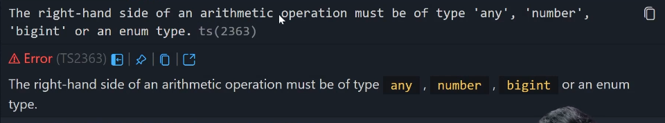

let x: number = 5
->good

let x: number = 5n
-> will give error like bigint can't be stored in type number
so where this error is stored? 
in typescript repo: src/compiler/diagnosticMessages.json
-> but how to find that exact error?
using the (ts 2322), given in the error, it is actually an error code which is stored directly

see this:
    "Type '{0}' is not assignable to type '{1}'.": {
        "category": "Error",
        "code": 2322
    },

see this error: 

event if we dont give type:
let x = 5

x = 'raquib' 
-> will give error as type was inferred

but, here it goes interesting:
let x: any
// let x;

x = 5;
-> accepted
x = 'raquib'
-> accepted

x has any type, so any value can be assigned to it